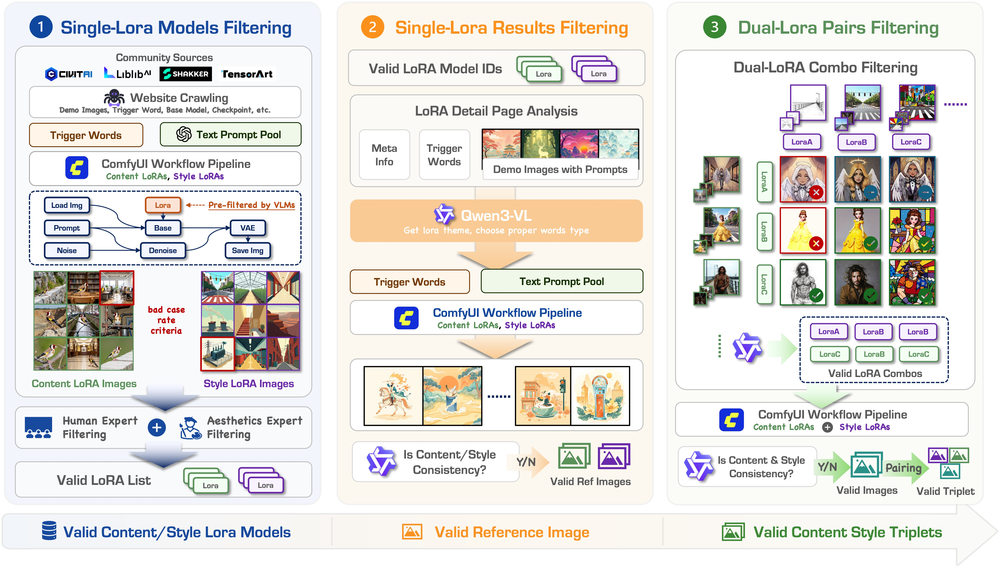

<div align="center">

# FreeStyle: Free Control of Style-Content Dual-Reference Generation from Community LoRA Mining

<p>
<a href="https://fudan.edu.cn"><b>Jinghong Lan</b></a><sup>1,2*</sup> &nbsp;
<a href="https://wchengad.github.io/"><b>Wei Cheng</b></a><sup>2*</sup> &nbsp;
<a href="https://scholar.google.com/citations?user=IFAVxk8AAAAJ&hl=zh-CN"><b>Yunuo Chen</b></a><sup>2</sup> &nbsp;
<a href="https://scholar.google.com/citations?user=GA0gV5cAAAAJ&hl=zh-CN"><b>Ziqi Ye</b></a><sup>1</sup> &nbsp;
<a href="https://scholar.google.com/citations?user=k_jXsNYAAAAJ&hl=zh-CN"><b>Peng Xing</b></a><sup>2</sup> &nbsp;
<a href="https://scholar.google.com/citations?user=yDNIBE0AAAAJ&hl=zh-CN"><b>Yixiao Fang</b></a><sup>2</sup> &nbsp;
<a href="https://scholar.google.com/citations?user=nVR6p7cAAAAJ&hl=zh-CN"><b>Rui Wang</b></a><sup>2</sup> <br>
<a href="https://github.com/yfyang007/"><b>Yufeng Yang</b></a><sup>2</sup> &nbsp;
<a href="https://scholar.google.com/citations?user=oPV20eMAAAAJ&hl=zh-CN"><b>Xuanyang Zhang</b></a><sup>2</sup> &nbsp;
<a href="https://scholar.google.com/citations?user=tgDc0fsAAAAJ&hl=en"><b>Xianfang Zeng</b></a><sup>2</sup> &nbsp;
<a href="https://difanzou.github.io/"><b>Difan Zou</b></a><sup>4</sup> &nbsp;
<a href="https://www.skicyyu.org/"><b>Gang Yu</b></a><sup>2‡</sup> &nbsp;
<a href="https://icoz69.github.io/"><b>Chi Zhang</b></a><sup>3‡</sup>
</p>

<p>
<sup>1</sup> Fudan University &nbsp;&nbsp; <sup>2</sup> StepFun &nbsp;&nbsp; <sup>3</sup> Westlake University &nbsp;&nbsp; <sup>3</sup> University of Hong Kong <br>
<sub><sup>*</sup> Equal contribution &nbsp;&nbsp; <sup>‡</sup> Corresponding authors</sub>
</p>

<!-- ============================================================= -->
<!--  RESOURCE LINKS — remaining "#" placeholders to fill on release -->
<!-- ============================================================= -->

<p>
<a href="https://blue2giant.github.io/FreeStyle/"></a>
<a href="https://github.com/Blue2Giant/FreeStyle"></a>
<a href="https://arxiv.org/pdf/2606.20506"></a>

</p>

<p>
<a href="https://huggingface.co/datasets/Blue2Giant/FreeStyle_Dataset"></a>
<a href="https://huggingface.co/datasets/Blue2Giant/FreeStyle_Bench"></a>
<a href="https://huggingface.co/Blue2Giant/FreeStyle_Checkpoint"></a>
<a href="https://huggingface.co/datasets/Blue2Giant/free_style_lora_meta"></a>
</p>

<!--
  TODO before public release — still need URLs for:
  • Paper         : arXiv / CVPR link
  • Demo          : HuggingFace Space
-->

<br>


</div>

---

## Motivation

**FreeStyle** is a scalable, multi-reference image-generation data pipeline for both **style reference** and **content reference**. Its key insight is that the open-source community already hosts a vast collection of **LoRA** weights covering a rich and diverse range of content and style themes. Each LoRA can naturally be viewed as a clustering center for a style or a content concept, and because LoRAs are inherently **composable** — and can be further steered with prompts to inject rich visual semantics — they can be leveraged to obtain abundant **dual-reference** data. However, due to the inherent instability of LoRAs, a reliable data pipeline is needed to develop and exploit them. We implement this intricate pipeline and use it to train our own model.

On top of the data, FreeStyle contributes (1) a **benchmark** for SRef and CRef+SRef generation with a multi-dimensional evaluation protocol, and (2) a **DiT-based model** with an **attention-level constraint** and **RoPE low-frequency modulation** that suppresses style-reference content leakage while preserving style richness.

---

## Highlights

- **📦 Two Datasets, Two Tasks.** We open-source a large-scale dataset covering **both** reference settings. The **CRef+SRef** dataset provides `(content reference, style reference, text, target)` triplets for content-and-style **dual-reference generation** — **~480K** sequences (Flux `273,682` + Illustrious `172,589` + Qwen `33,582`) spanning **1,704 styles** — while the **traditional SRef** dataset targets **pure style-reference generation** with **619,302** sequences across **622 styles**. 
- **🧬 Community LoRA Mining Pipeline.** Treats community LoRAs (Civitai / TensorArt / Liblib) as clustering centers for style and content, turning a fragmented ecosystem into structured dual-reference supervision. Generate Cref+Sref triplet by comfyui workflow and validated lora, all lora meta information and workflow included in this repo. This pipeline generate the content-and-style dual-reference generation dataset.
- **🎨 A Trained Model.** Leveraging this data, we train our own model that achieves strong results on **both** the **style-reference (SRef)** and the **content + style dual-reference (CRef+SRef)** tasks, faithfully preserving reference style while suppressing content leakage.
- **📊 A Dedicated Benchmark.** Evaluates **style similarity, content preservation, aesthetics, instruction following, and leakage rejection**, combining encoder metrics (CSD, OneIG, DINOv2, CAS, CLIP-T, aesthetic predictors) with VLM-as-judge protocols.


<div align="center">

<br><sub><b>Overview of the FreeStyle data-construction pipeline:</b> mine community LoRAs → screen & categorize → generate and verify reference images → compose style×content into SRef / CRef triplets.</sub>
</div>

---

## What's in this Repository

This repo is organized into three self-contained components. **Each subfolder has its own detailed README** — click through for full instructions.

| Component | Folder | What it provides | Docs |
|---|---|---|---|
| 🏭 **LoRA Data Pipeline** | [`lora_pipeline/`](lora_pipeline/) | Batch data production: mine community LoRAs and generate dual-reference triplets via a ComfyUI SDK across Flux / Qwen / Illustrious / SDXL, plus all mining metadata (model IDs, trigger words, prompt pools, workflows). | [📖 README](lora_pipeline/README.md) |
| 📊 **Benchmark Inference & Metrics** | [`benchmark_infer/`](benchmark_infer/) | End-to-end benchmark toolkit: run inference for many baselines (FLUX, Qwen, TeleStyle, Seedream, CSGO, USO, OmniStyle), caption reference images, and compute all evaluation metrics. | [📖 README](benchmark_infer/README.md) |
| 🎨 **Model Inference** | [`model_infer/`](model_infer/) | Minimal inference demo for the FreeStyle model: two images + a prompt → generated image. Ships weight presets for SRef and CRef+SRef (with/without RoPE) and a Qwen3-VL recaption stage. | [📖 README](model_infer/README.md) |

---

## Open-Source Resources

We release the full stack behind FreeStyle:

| Resource | Description | Link |
|---|---|---|
| 🤗 **Dataset** | Large-scale style–content dual-reference triplets across multiple base models. | [FreeStyle Dataset](https://huggingface.co/datasets/Blue2Giant/FreeStyle_Dataset) |
| 🤗 **Benchmark** | SRef & CRef+SRef evaluation sets (`sref` / `cref_sref` tasks). | [FreeStyle Bench](https://huggingface.co/datasets/Blue2Giant/FreeStyle_Bench) |
| 🤗 **Model Weights** | SRef and CRef+SRef checkpoints (with and without RoPE modulation). |[FreeStyle Checkpoint](https://huggingface.co/Blue2Giant/FreeStyle_Checkpoint) |
| 🤗 **LoRA Mining Metadata** | Curated community LoRA IDs, verified trigger words, prompt pools, and ComfyUI workflows. | [FreeStyle Lora Meta](https://huggingface.co/datasets/Blue2Giant/free_style_lora_meta) |
| 🌐 **Project Page** | Interactive results, comparisons, and qualitative galleries. | [Project Page](https://blue2giant.github.io/FreeStyle/) |

> The benchmark inference scripts already reference a HuggingFace benchmark layout (`cref/`, `sref/`, `prompts.json`, per-model outputs); see [`benchmark_infer/README.md`](benchmark_infer/README.md) for the exact structure.

> **📩 Style-transfer data — available on request.** The **style-transfer** subset of the dataset is **not** hosted publicly. To obtain it, please email **ljh_sjtu@163.com** to request access.

---

## Quick Start

Pick the component you need — full setup lives in each subfolder README.

### 1 · Generate from the FreeStyle model (`model_infer/`)

Two reference images + a prompt → one generated image.

```bash
cd model_infer
conda activate Sref

python3 cref_sref_core_infer.py \
  assets/00-cref.jpg \
  assets/00-sref.jpg \
  'Transfer the style of image 2 onto image 1, keeping image 1's layout.' \
  --weight_preset sref_14000 \
  --recaption_task_type style_transfer \
  --out_dir outputs/demo \
  --steps 28 --cfg 8 --seed 42 --overwrite
```


### 2 · Produce triplet data (`lora_pipeline/`)

```bash
cd lora_pipeline
bash meta/comfyui_start_new_server.sh        # launch ComfyUI on every GPU
python probe_comfy_ports.py --shell-file scripts/one_lora_flux.sh --start-port 8188 --port-count 8
bash scripts/one_lora_flux.sh                # batch single-LoRA inference
```

→ See [`lora_pipeline/README.md`](lora_pipeline/README.md) for mining metadata, workflows, and dual-LoRA composition.

### 3 · Run the benchmark (`benchmark_infer/`)

```bash
cd benchmark_infer
conda create -n sref python=3.10 -y && conda activate sref
pip install torch==2.6.0 torchvision==0.21.0 torchaudio==2.6.0 --index-url https://download.pytorch.org/whl/cu124
pip install -r requirements.txt

bash scripts/inference/uso_batch_run.sh     # generate
bash scripts/metrics/uso_metric_batch.sh     # one-stop evaluation
```

→ See [`benchmark_infer/README.md`](benchmark_infer/README.md) for model paths, the Qwen3-VL judge service, and metric details.

---

## Citation

If you find FreeStyle useful for your research, please consider citing:

```bibtex
@inproceedings{lan2026freestyle,
  title     = {FreeStyle: Free Control of Style Content Generation from Community LoRA Mining},
  author    = {Lan, Jinghong and Cheng, Wei and Chen, Yunuo and Ye, Ziqi and Xing, Peng and Fang, Yixiao and Wang, Rui and Yang, Yufeng and Zhang, Xuanyang and Zou, Difan and Zeng, Xianfang andYu, Gang and Zhang, Chi},
  booktitle = {arXiv Pre-print},
  year      = {2026}
}
```

---

## Acknowledgements

FreeStyle builds on the open-source community's LoRA ecosystem ([Civitai](https://civitai.com), TensorArt, Liblib) and on excellent prior work including [ComfyUI](https://github.com/comfyanonymous/ComfyUI), [ComfyKit](https://github.com/puke3615/ComfyKit), Qwen-Image / Qwen3-VL, FLUX, and the many style-transfer baselines compared in our benchmark (CSGO, USO, OmniStyle, TeleStyle, and others). In particular, we are grateful to the [Qwen-Image-Edit](https://qwen.ai/blog?id=qwen-image-edit) team for open-sourcing such a powerful base model. We thank the creators of every mined LoRA whose contributions made this dataset possible.

---

## Disclaimer

This project, including all associated datasets, benchmarks, model weights, and code, is released **strictly for academic research and non-commercial use only**.

- **Style-reference (SRef) data.** Portions of the SRef data may incorporate publicly available images collected from the web. Such material is used **solely for the purpose of scientific research** — namely studying style representation and reference-based image generation — under a good-faith understanding of fair use for non-commercial academic research. We do **not** claim ownership of any third-party content, and all rights, including copyright and trademarks, remain with their respective owners.
- **Community LoRAs.** LoRA weights mined from community platforms (Civitai, TensorArt, Liblib, etc.) are referenced via their original metadata and remain subject to the licenses and terms set by their original authors and host platforms. We redistribute only metadata and derived data, not the original LoRA weights themselves where their licenses prohibit redistribution.
- **No warranty.** All resources are provided on an **"AS IS" basis, without warranties or conditions of any kind**, express or implied. The authors and their affiliated institutions assume **no liability** for any direct or indirect damages, legal claims, or losses arising from the use, misuse, or inability to use these resources.
- **User responsibility.** Users are solely responsible for ensuring that their use of this project — including any generated content — complies with all applicable laws, regulations, and third-party terms of service in their jurisdiction. Any use for commercial purposes, redistribution of third-party content, or generation of unlawful, infringing, or harmful material is **expressly prohibited**.
- **Takedown requests.** If you are a rights holder and believe that any content in this project infringes your rights, please contact us by opening a GitHub issue. We are committed to promptly reviewing and, where appropriate, **removing** the relevant content.

By accessing or using any part of this project, you acknowledge that you have read, understood, and agreed to this disclaimer.

---

<div align="center">
<sub>For questions and issues, please open a GitHub issue. ⭐ Star the repo to follow updates as we release the dataset, benchmark, and weights.</sub>
</div>
